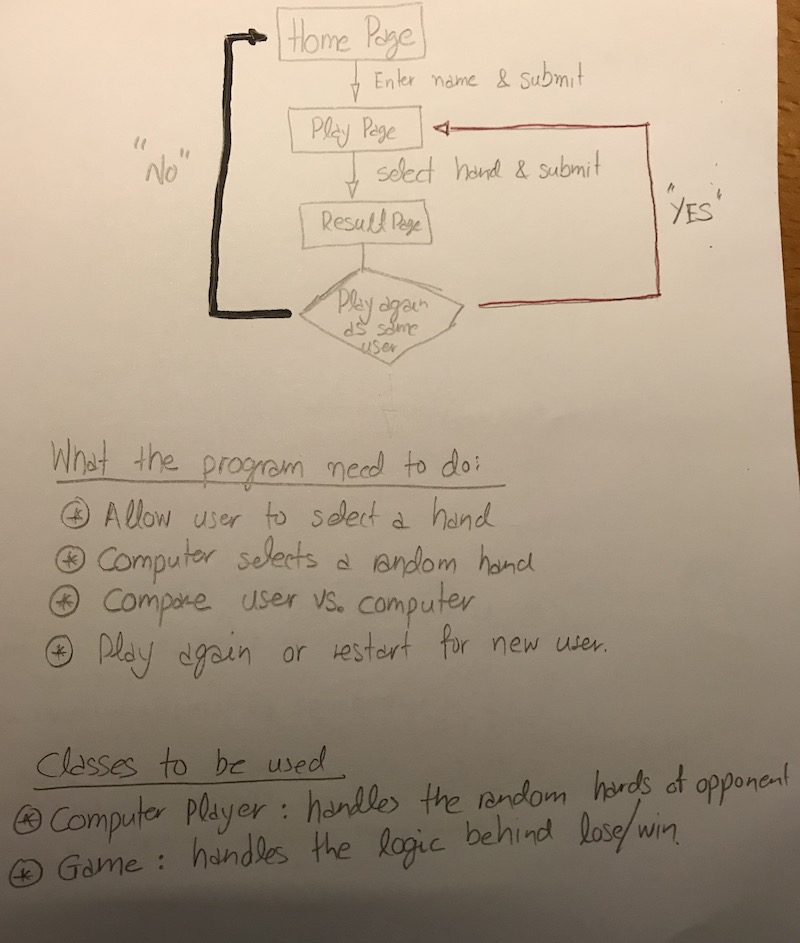

[](http://forthebadge.com)
[](http://forthebadge.com)
[](http://forthebadge.com)


# RPS Challenge

## Steps taken to tackle this Challenge
- Diagram the user stories and decide what classes and methods I would need to use.
- Find a way to apply the single responsibility principle, so that each class would be responsible for only a certain task
- Refactor the code

## Basic Rules

- Rock beats Scissors
- Scissors beats Paper
- Paper beats Rock

## How to use this depository
First you need to clone the depository on your local machine. To do so, please open your favourite CLI and use the following commands:

```
git clone git@github.com:lunaticnick/makersacademy-mcw03-rps-challenge.git local_directory_name
cd local_directory_name
```

Then you need to install all the prerequisites using bundler by running the command ```$ bundle```. If you don't have bundler already installed, please run ```$ gem install bundle``` if you don't have bundle already installed.

Once bundler has completed all the prerequisites, you can start playing the game by using the following command:

```
rps-challenge_folder$ rackup

```
and navigating using your preferred webbrowser to ```localhost:9292``` and follow the onscreen instructions:

Fill in name


Select your "weapon"


The game announces the winner


## Diagrams



## Further Work
- Apply the Singleton Pattern & Refactor
- Make methods a bit shorter
- Change the game so that two marketeers can play against each other
- Rock, Paper, Scissors, Spock, Lizard Update (more complex rules)
